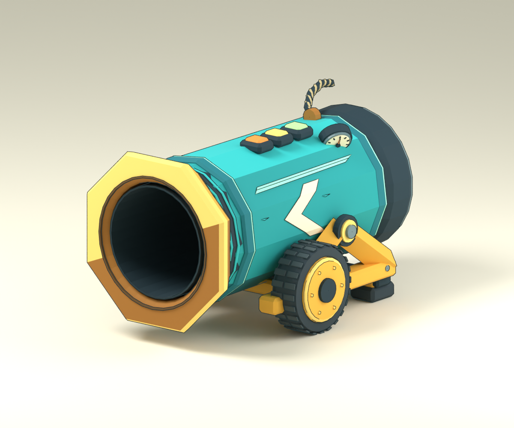

# Ball cannon: concept to shared courtyard

Built from the actual Canvas cannon contract in `dafepro/fc-workout-pwa`, not from
its name alone. The [source audit](cannon-source-audit.md) pins both inspected
repositories and separates observed behavior from the 3D adaptations. The original
is a fixed ball recycler: rear contact, 0.8-second fuse, same-ball launch, and
0.75-second per-ball cooldown. It has no ammunition inventory or manual fire button.

## Art pipeline and review record

1. **Source study.** Read the item definition, behavior dispatch, collision masks,
   SVG, unit tests and browser tests. Carry forward the teal barrel, broad gold
   muzzle, dark open intake, gold cradle, paired rubber wheels and cream chevron.
2. **Imagegen concept.** Generate a new hero plus front/side/rear/top turnaround and
   a loading/firing vignette. The complete prompt is
   [`assets/concepts/cannon/prompt.txt`](../assets/concepts/cannon/prompt.txt);
   the original output is
   [the reference sheet](../assets/concepts/cannon/turnaround.png).
   Generated with the built-in imagegen tool on September 9, 2026. The resulting
   sheet is direction for modeling, not a measurement authority: its perspective
   and annotated dimensions are not perfectly consistent.
3. **Interactive Blender construction.** Execute
   [`build_cannon.py`](../assets/source/cannon/build_cannon.py) through the connected
   Blender MCP. It creates its own scene and preserves other open scenes. All
   authoring helpers use X right, Y up, +Z toward the muzzle; glTF conversion
   explicitly preserves those conventions. The concept image is packed into the
   editable scene. Barrel, openings, cast cradle, treads, hubs, pivots, gauge,
   needle, fuse braid, indicator windows, and conforming paint are real geometry.
4. **First actual render.** [Iteration 1](evidence/cannon/hero-v1.png) revealed
   barrel facets cutting through the side marking, overlapping tube surfaces
   striping the bore, and tread blocks reading as gear teeth. Split the painted
   marking at facet boundaries, clear the nested tube walls, and lower the tread
   relief. [Iteration 2](evidence/cannon/hero-v2.png) records that correction.
5. **Orthographic clearance review.** Front and rear views exposed cradle arms
   and a cross axle intruding into the lower bore. Move supports outward, reduce
   and align the axle, and check the actual GLB with rays through the full bore.
   This became a regression test, not just a corrected screenshot. Final review
   and shared loading tests continued on September 15, 2026.
6. **Export and browser interpretation.** Export copies merge static geometry by
   rigid parent; the editable source retains all 189 mesh pieces. Preserve stable
   mechanical names in glTF even when Blender adds suffixes between iterations.
   Restrict export to the active scene and selected cannon hierarchy, preventing
   unrelated selected objects in other open scenes from leaking into the asset.
7. **Shared behavior and visual QA.** Load the real GLB in the existing Fieldwork
   Action Yard, perform loading through ordinary pathing and kicking, and review
   accepted fuse, recoil and burst frames. Check multiple clients, host loss,
   malformed state, failed assets, reduced motion and cleanup. See
   [the integration and evidence](cannon-integration.md).



Final orthographic reviews: [front](evidence/cannon/front.png),
[side](evidence/cannon/side.png), [rear](evidence/cannon/rear.png),
and [top](evidence/cannon/top.png).

The final model is approximately 2.61 m long, 1.76 m wide including hubs and
1.64 m tall including fuse, with its bore centered at 0.85 m. The nominal front
socket is `(0, .85, 1.32)` and rear socket `(0, .85, -1.12)`. The wheel dimensions
and support clearance take precedence over inconsistent dimensions on the
generated sheet. Sharp planar paint, modeled bevels and silhouettes interpret
the concept; the browser adds the shared comic shader and ink outlines. The
reference's hand-painted scratches are deliberately simplified into a small
number of authored paint marks.

## Reproduce in the interactive Blender connection

Inspect the open scene before executing this. The builder creates a dedicated
review scene and does not clear or save over another open file.

```python
import bpy, runpy
m = runpy.run_path(
    '/Users/dcarrell/Documents/ZMap/assets/source/cannon/build_cannon.py',
    run_name='cannon_builder',
)
bpy.app.driver_namespace['zmap_cannon_builder'] = m
result = m['build']()
result['export'] = m['export']()
```

Then render named views in bounded calls and inspect the resulting images:

```python
result = bpy.app.driver_namespace['zmap_cannon_builder']['render']('hero')
# Also: front, rear, side, top.
```

The editable [ball-cannon.blend](../assets/source/cannon/ball-cannon.blend) is saved
with `bpy.data.libraries.write` from only the dedicated scene. Its packed reference,
five cameras and individual source parts remain editable. The runtime export is
[`ball-cannon.glb`](../examples/hub/public/models/ball-cannon.glb). The builder
writes a [manifest](../assets/source/cannon/manifest.json) with current byte and
triangle counts. It needs Blender's glTF exporter; no remote model library or
downloaded texture pack is involved.

## Physical and animation timeline

The 3D port retains the 24-tick total fuse and same-ball launch. It intentionally
adds a first-half loading path: center and lift the ball behind the lip, then
draw it down the bore. A floor ball cannot physically roll straight through an
opening centered at 0.85 m, so this is shared kinematic motion rather than a
renderer-only illusion. Intake flow makes the suction readable. Remaining fuse
time builds pressure, then the accepted launch triggers recoil, muzzle puff,
pressure ring, a short ball trail and nearby hands-free avatar reactions.

Launch speed is adapted to 14 m/s for this courtyard, rather than treating
Canvas units as metres. Cooldown is 23 ticks at 30 Hz (0.767 seconds), rounding
the original 0.75 seconds upward. One ball owns the chamber; other balls remain
interactive. The [world-object contract](world-objects.md) documents cancellation,
blocked outlets, recovery, capability negotiation and the consumer boundary.

## Asset acceptance checks

`tests/cannon-asset.test.ts` loads the actual shipped GLB and checks:

- A single cannon hierarchy, no skins or leaked concept images, stable mechanism
  names, finite geometry, aligned physical anchors and sensible physical bounds.
- A limit of 1 MiB, 16,000 triangles, 12 runtime meshes and 45 material primitives.
  Current export: **721,264 bytes, 14,000 triangles, 9 meshes, 38 primitives**.
  Ink rendering adds work beyond these source counts.
- Both open apertures and the entire tube at four radii, 64 angular samples and
  both directions: a 0.8 m ball plus 2.5 cm radial tolerance clears the geometry.

This proves sampled geometric clearance, not an arbitrary-mesh collision engine.
Review silhouettes and surface contact in the saved views as well. Browser and
simulation performance measurements remain local observations; they do not
replace the physical-phone and full-room requirements in `docs/specs.md`.
